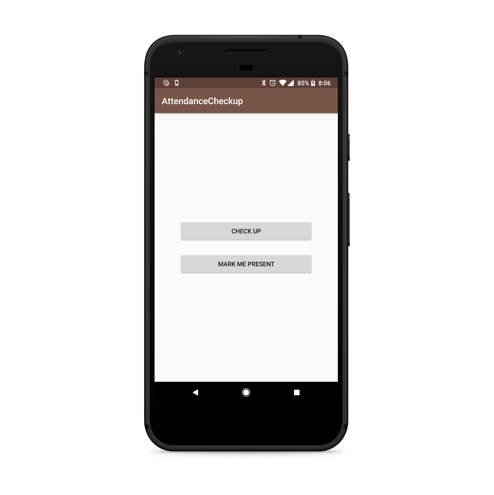
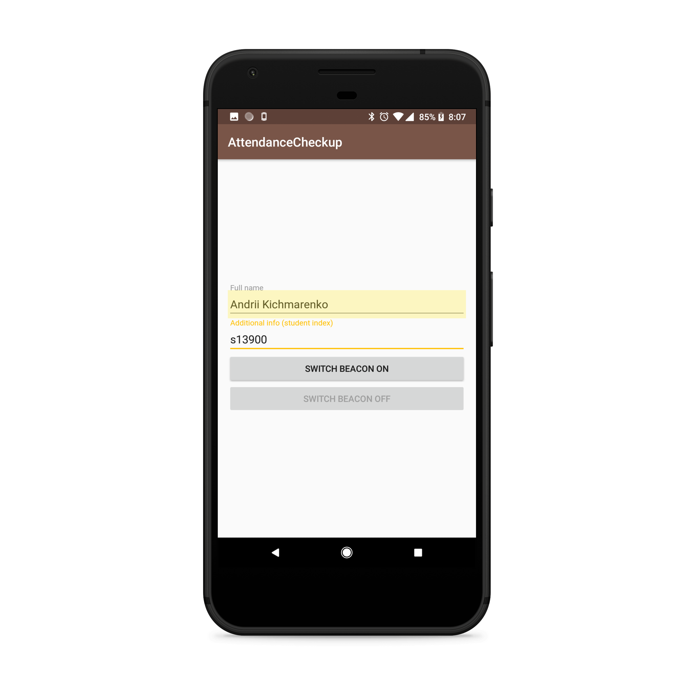
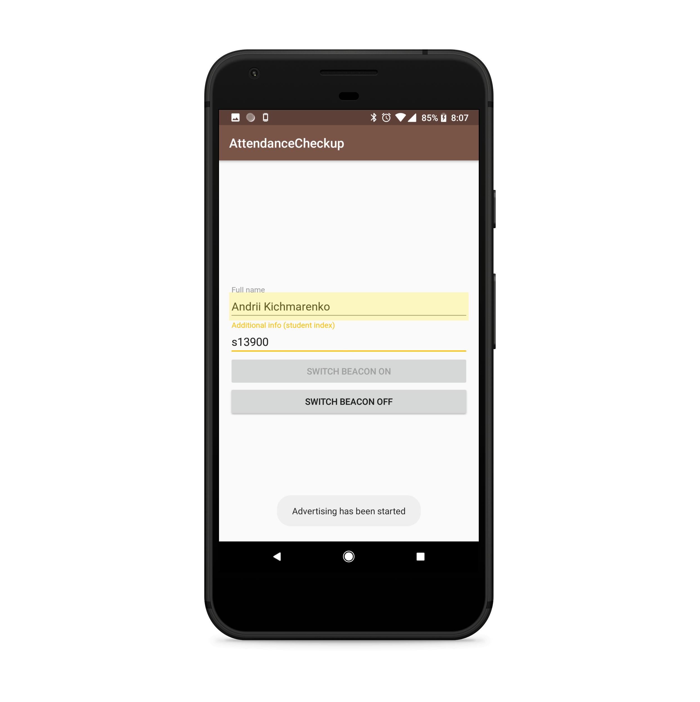

# AttendanceCheckup
This application provide ability to make list of members at a meeting.

## Introduction
Application use [android beacon library](https://altbeacon.github.io/android-beacon-library/).

**Note: Any device with Android 4.3+ and a Bluetooth Low Energy chipset can detect beacons with this library.**

There are two workflow modes: 
1. Ranging mode - find and make list of nearby beacons(members)
2. Advert mode - broadcast name and additional info like a beacon

Beacon simulator is swiched on by default to show application work.

## Screenshots

